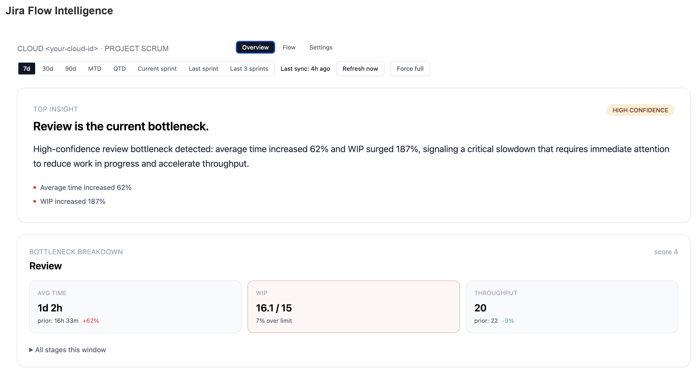
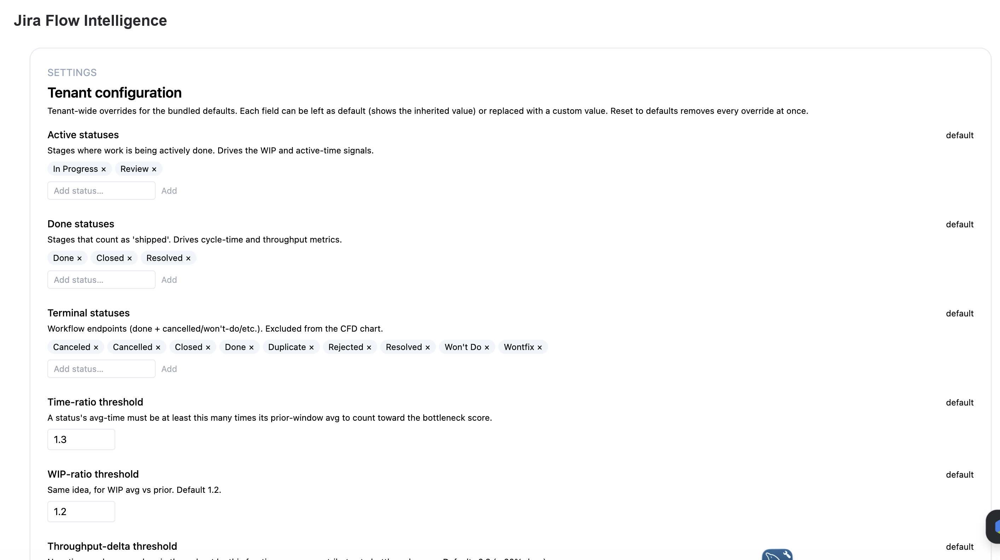
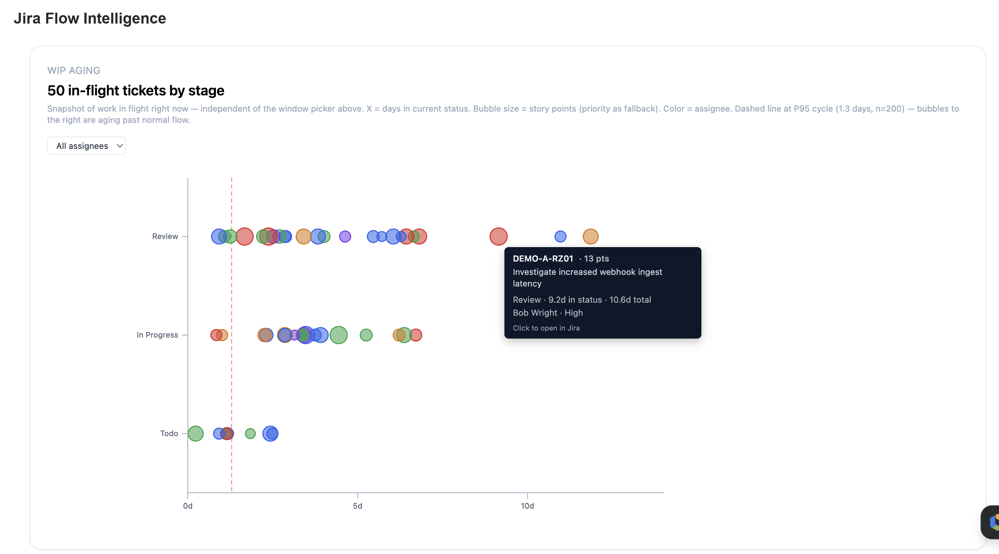
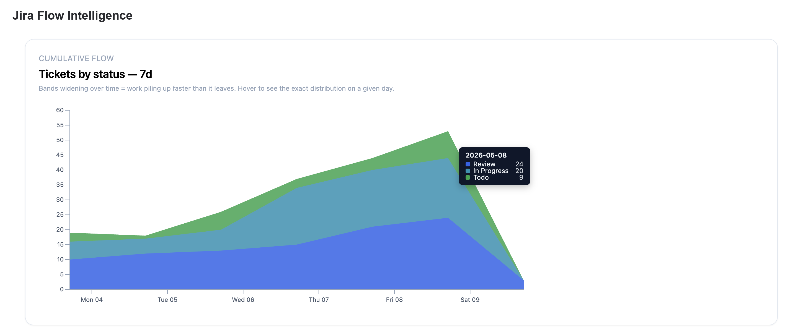
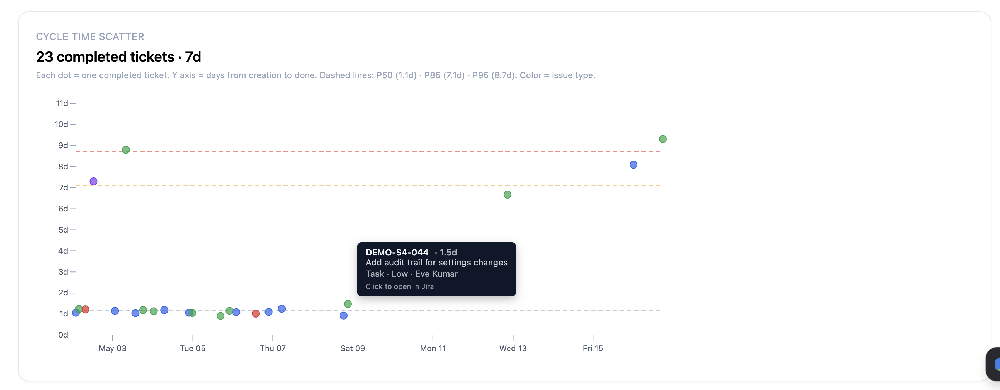
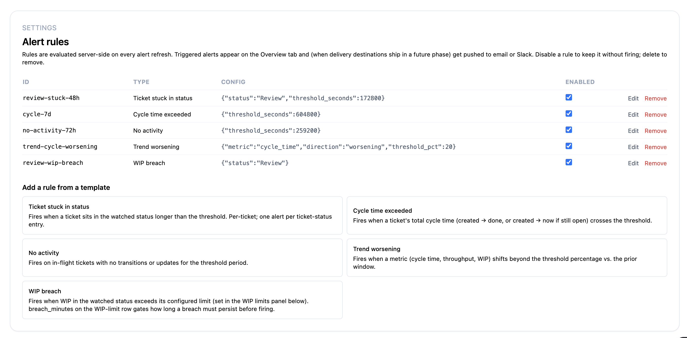

# Jira Flow Intelligence

[](LICENSE)
[](.github/workflows/ci.yml)

A **reference / starter implementation** of a real Jira plugin: a
[Forge](https://developer.atlassian.com/platform/forge/) Custom UI app backed by
a FastAPI analytics engine on AWS. It turns Jira issue changelogs into
deterministic flow metrics, multi-signal bottleneck detection, and
threshold/trend alerts.

This repository is **generalized from a working plugin** so you can use it as a
base: it ships with placeholder values (an example Forge app id, `example.com`
domains, and so on) that you replace with your own. Wire in your own free
Atlassian developer account and you can run the whole thing end to end — see
[docs/SETUP.md](docs/SETUP.md).

It is meant to be read and reused, not installed as-is: there is no hosted
service behind it. Every value you must change is listed in
[Configure your own values](#configure-your-own-values) below — no hidden
placeholders.

## What's in the box

| Area | Path | What it is |
|---|---|---|
| **Backend engine** | `backend/` | FastAPI + SQLAlchemy. Changelog-driven flow metrics, bottleneck detection, alerting, WIP limits, sprint/calendar windows, CSV export. Multi-tenant: app-level `tenant_id` scoping **plus** Postgres Row-Level Security as a defense-in-depth backstop. Alembic migrations. Deterministic engine — AI is used only to phrase one-sentence explanations, never to compute numbers. |
| **Forge app** | `forge-prod/` | The in-Jira surface. Custom UI dashboard (Vite + React + Tailwind) + resolvers, calling the backend via Forge Remote with Forge Invocation Token (FIT) auth. |
| **Infrastructure** | `infra/` | AWS CDK (Python): ECR, VPC/network, RDS Postgres, App Runner compute, and observability (CloudWatch alarms + Route 53 health check). |
| **CI** | `.github/workflows/` | Path-aware pipeline: backend lint/type/test, Postgres RLS smoke test, Forge build, and infra synth + tests. |
| **Docs** | `docs/` | Architecture Decision Records (`engineering/adr/`), an operator [runbook](docs/engineering/runbook.md), an end-user [manual](docs/user-manual/), a [setup tutorial](docs/SETUP.md), and a [Marketplace publishing guide](docs/PUBLISHING.md). |

### Features

- **Bottleneck detection** — scores each workflow stage on time-ratio, WIP-ratio,
  and throughput-delta signals; names the stage most likely slowing delivery.
- **Flow metrics** — cycle time, time-in-status, throughput, cumulative flow
  diagram, cycle-time scatter, WIP-aging.
- **WIP limits** — per-status caps that turn raw WIP averages into
  `current / limit` signals.
- **Alerting** — status-duration, cycle-time, no-activity, trend, and WIP-breach
  rules, delivered by email (and pluggable Slack/Teams webhooks).
- **Windows** — rolling-day (7/30/90), calendar (MTD/QTD), and sprint-bucketed.
- **Multi-tenant** — one Jira site per tenant, isolated by middleware + RLS.

## Screenshots

Captured against the deterministic demo seed (branding + Cloud ID are neutral
placeholders). Click any thumbnail for the full image; see
[docs/screenshots/](docs/screenshots/) for captions and details.

| | | |
|:--:|:--:|:--:|
| [](docs/screenshots/01-overview-bottleneck-wip-breach.png) | [](docs/screenshots/02-tenant-configuration.png) | [](docs/screenshots/03-wip-aging.png) |
| Overview & bottleneck | Tenant configuration | WIP aging |
| [](docs/screenshots/04-cumulative-flow.png) | [](docs/screenshots/05-cycle-time-scatter.png) | [](docs/screenshots/06-alert-rules.png) |
| Cumulative flow | Cycle-time scatter | Alert rules |

## Architecture

```
Jira (Forge Custom UI)  ──requestRemote/FIT──▶  FastAPI backend (AWS App Runner)
      forge-prod/                                    backend/
      React dashboard + resolvers                    engine + routers + services
                                                          │
                                                          ▼
                                                   RDS Postgres (RLS)
                                                   provisioned by infra/ (CDK)
```

The Forge Custom UI is served by Atlassian's CDN and calls the FastAPI backend
via `@forge/bridge` `requestRemote`; the backend validates the Forge Invocation
Token against Atlassian's JWKS. See
[ADR-0019](docs/engineering/adr/0019-pivot-to-forge.md) for the platform choice.

## Configure your own values

Everything below ships with a placeholder default. Replace each one to run this
as **your** plugin. Nothing is hidden — this table is the complete list, derived
from [`.env.example`](.env.example) and
[`forge-prod/manifest.yml`](forge-prod/manifest.yml).

| Value | What it is | How to obtain | Where it lives |
|---|---|---|---|
| **Forge app id** (`REPLACE-WITH-YOUR-APP-ID`) | The Forge app ARI (`ari:cloud:ecosystem::app/<uuid>`). | Run `forge register` in `forge-prod/`. | `forge-prod/manifest.yml` → `app.id` |
| `FORGE_APP_ID` | Same ARI as above — the audience every Forge Invocation Token must carry. Empty disables Forge auth (local dev only). | Copy the value `forge register` produced. | `.env` (backend) |
| **Backend URL** (`https://api.example.com`) | Public HTTPS URL the Forge app calls. | Your deployed backend host — the App Runner URL, or a custom domain / `BackendUrl` CDK output. | `forge-prod/manifest.yml` → `remotes[].baseUrl` |
| **App icon** (`https://example.com/icon.svg`) | Marketplace/app icon URL. | Host your own icon and paste its URL. | `forge-prod/manifest.yml` → `modules...icon` |
| `JIRA_BASE_URL` (`https://your-company.atlassian.net`) | Your Atlassian Cloud site. | Your Jira site URL. | `.env` |
| `JIRA_EMAIL` (`you@example.com`) | Atlassian account email for API-token auth (local dev sync path). | Your Atlassian login email. | `.env` |
| `JIRA_API_TOKEN` | Atlassian API token. | <https://id.atlassian.com/manage-profile/security/api-tokens> | `.env` |
| `JIRA_JQL` | JQL selecting which issues to ingest. | Write to match your projects. | `.env` |
| `AWS_REGION` (`us-east-1`) | Region for the Secrets Manager client that fetches the Resend API key. | Your AWS region. | `.env` |
| `RESEND_API_KEY` | Resend API key for transactional email. | <https://resend.com/api-keys> | **AWS Secrets Manager** (`flow-intelligence/<env>/resend_api_key`), set via `aws secretsmanager put-secret-value` — see the runbook. Not in `.env`. Set `RESEND_DRY_RUN=1` locally to skip email. |
| `RESEND_FROM_ADDRESS` (`notifications@example.com`) | Operational "From" address. | Any address on a domain you've verified in Resend. | `.env` |
| `RESEND_REPLY_TO` (`support@example.com`) | Reply-to + the support address shown in email bodies. | Your support address. | `.env` |
| `ALERT_FROM_ADDRESS` (`... <alerts@example.com>`) | "From" for alert-delivery emails (display name allowed). | Any verified-domain address. | `.env` |
| `APP_VENDOR_URL` (`https://example.com`) | Your public vendor / marketing URL. | Your website. | `.env` |
| `ANTHROPIC_API_KEY` *(optional)* | Enables AI-phrased insight sentences; falls back to a deterministic template when unset. | <https://console.anthropic.com/> | `.env` |
| `DATABASE_URL` *(optional)* | Defaults to local SQLite; set to a Postgres URL for production. | Your DB connection string (RDS credentials come from Secrets Manager in prod). | `.env` |
| `ALERT_EMAIL` (default `alerts@example.com`) | Recipient subscribed to the ops-alert SNS topic (surfaced as the `AlertEmailRecipient` stack output; subscribe manually per the runbook). | Your ops inbox. | Infra (CDK): `ALERT_EMAIL` env var or `-c alert_email=...` at `cdk deploy` |
| `HEALTHZ_HOST` (default `api.example.com`) | Public host Route 53 pings for the prod `/healthz` uptime check. | Your backend's public host. | Infra (CDK): `HEALTHZ_HOST` env var or `-c healthz_host=...` at `cdk deploy` |

> The immutable product spec under `docs/jira_flow_intelligence/` is bootstrap
> input; you don't need to change it to run the app.

## Quickstart

The full, from-zero walkthrough — free Atlassian account, Forge register, local
backend, deploy, and optional AWS — is in **[docs/SETUP.md](docs/SETUP.md)**.

At a glance:

```bash
# Backend
uv sync
DATABASE_URL=sqlite:///backend/data/flow.db PYTHONPATH=backend uv run alembic upgrade head
PYTHONPATH=backend uv run uvicorn app.main:app --reload

# Forge app
cd forge-prod && npm install && forge register   # paste the app id into manifest.yml
cd frontend && npm install && npm run build && cd ..
forge deploy --environment development
forge install --environment development --site your-site.atlassian.net --product Jira
```

## Contributing & security

- Contribution guidelines: [CONTRIBUTING.md](CONTRIBUTING.md)
- Vulnerability reporting: [SECURITY.md](SECURITY.md)
- Change history: [CHANGELOG.md](CHANGELOG.md)

## License

[MIT](LICENSE) — see the LICENSE file for the copyright notice.
